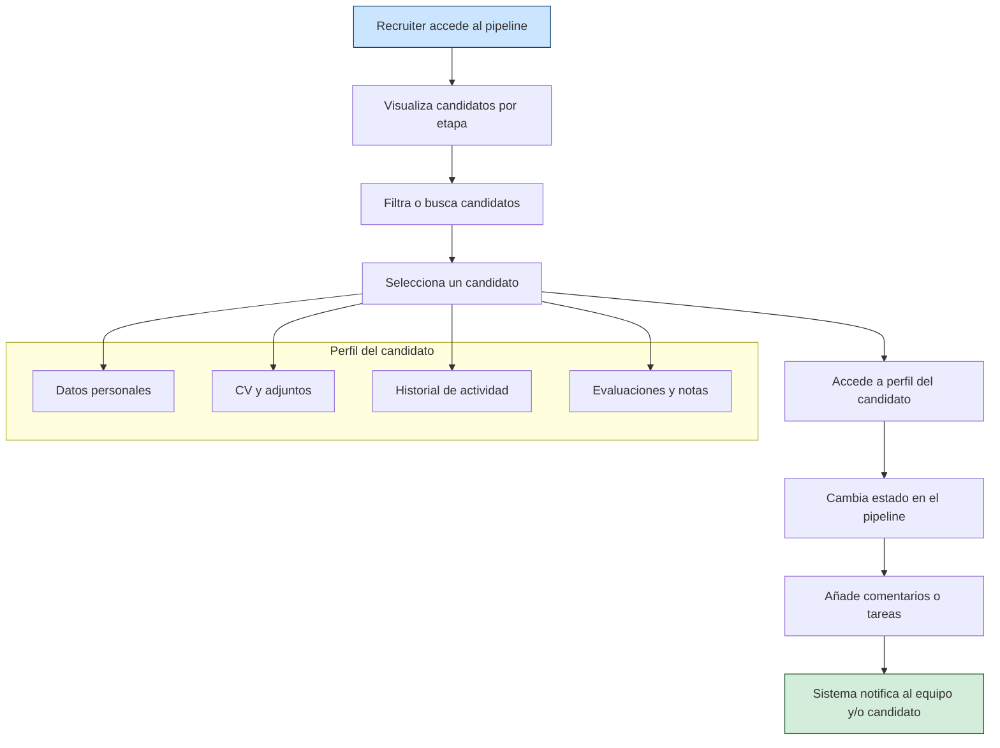
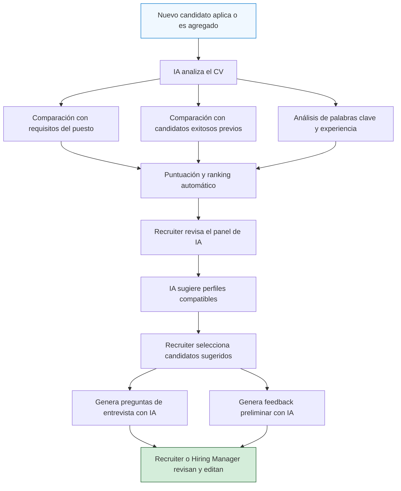
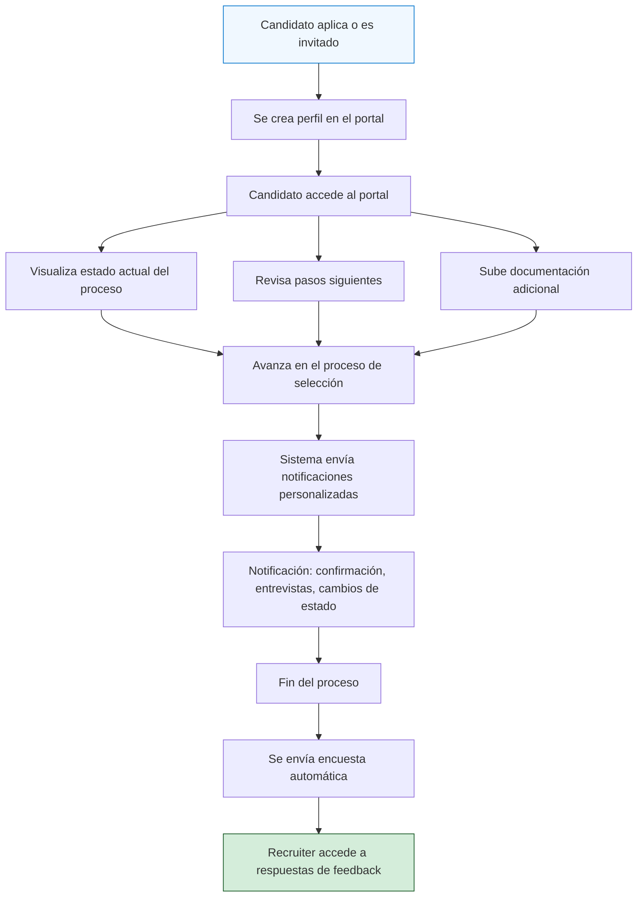
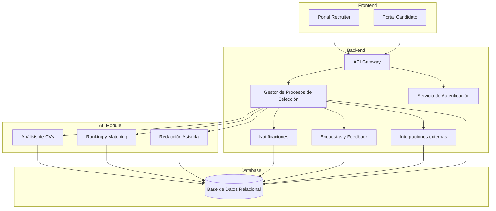
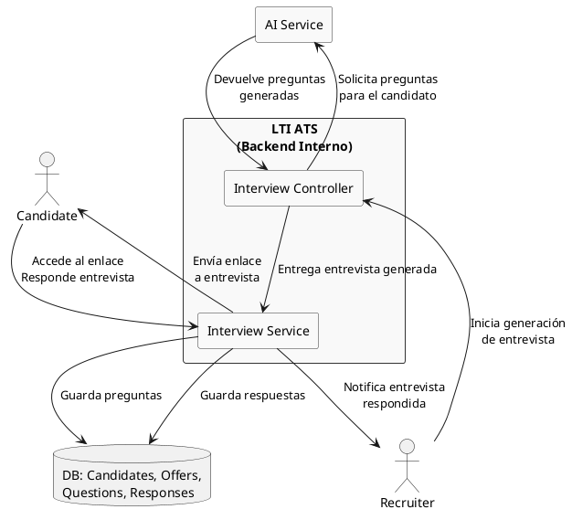
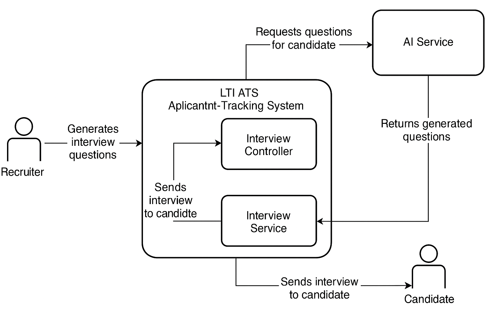

# LTI: Plataforma ATS del Futuro

## 📌 Descripción General

**LTI** (Let’s Track Intelligence) es una plataforma de próxima generación para la gestión de procesos de selección (ATS - Applicant Tracking System). Nuestro propósito es revolucionar la forma en la que los equipos de recursos humanos, reclutadores y managers colaboran, seleccionan y contratan talento. Apostamos por la **automatización inteligente**, la **colaboración en tiempo real** y la **experiencia de usuario fluida** como ejes centrales del producto.

## 💡 Valor Añadido

- **Eficiencia operativa**: automatización de tareas repetitivas y mejora de flujos de trabajo.
- **Colaboración mejorada**: funcionalidades en tiempo real para equipos de RRHH y managers.
- **Asistencia de IA**: desde análisis de CVs hasta redacción automática de feedback.
- **Adaptabilidad y escalabilidad**: desde startups a grandes corporaciones.
- **Experiencia superior**: interfaz intuitiva centrada en el usuario, accesible y moderna.

## 🔧 Funcionalidades Clave

1. **Gestión centralizada de candidatos**
    - Pipeline visual y personalizable
    - Estados automatizados y filtros avanzados
    - Perfil unificado por candidato

2. **IA en el proceso de selección**
    - Ranking inteligente de CVs
    - Sugerencias automáticas de perfiles compatibles
    - Redacción asistida de entrevistas y preguntas

3. **Colaboración en tiempo real**
    - Comentarios en candidatos estilo “Google Docs”
    - Notificaciones inteligentes
    - Seguimiento de decisiones por etapas

4. **Automatizaciones**
    - Emails automáticos según estado
    - Recordatorios y tareas programadas
    - Integración con calendarios y sistemas de videollamadas

5. **Analytics & Reporting**
    - Tiempos promedio de contratación
    - Embudo de conversión
    - Comparativas por recruiter, canal y etapa

6. **Integraciones**
    - LinkedIn, Google Calendar, Zoom, Slack, entre otros
    - API para conectar con herramientas internas

7. **Experiencia del candidato**
    - Portal del candidato moderno y accesible
    - Notificaciones claras y personalizadas
    - Encuestas automáticas post-proceso

---

## 📊 Lean Canvas

```plaintext
| Problema                         | Solución                        | Métricas Clave                       |
|----------------------------------|----------------------------------|--------------------------------------|
| - Procesos de selección lentos   | - ATS centrado en eficiencia     | - Tiempo medio hasta contratación    |
| - Mala comunicación interna      | - Colaboración en tiempo real    | - % de feedback dado por etapa      |
| - Volumen alto de candidatos     | - IA para filtrar y clasificar   | - Ratio CVs procesados/contratados  |

| Propuesta de Valor Único        | Ventaja Competitiva              | Canales                             |
|----------------------------------|----------------------------------|--------------------------------------|
| ATS asistido por IA con UX top  | - UX fluida + IA aplicada        | - Directo a RRHH vía inbound         |
| para colaboración total         | - Integraciones nativas          | - Partnerships con portales de empleo|

| Segmentos de Cliente            | Cost Structure                   | Revenue Streams                      |
|----------------------------------|----------------------------------|--------------------------------------|
| - Startups en crecimiento       | - Infraestructura cloud          | - SaaS mensual por seats             |
| - Equipos de RRHH modernos      | - Coste de desarrollo IA         | - Planes premium con features extra  |
| - Empresas tech medianas        | - Soporte y atención al cliente  | - Marketplace (si aplica futuro)     |
```

---

# Casos de Uso Principales

## Caso de Uso: Gestión centralizada de candidatos

### 🎯 Descripción general

La funcionalidad de "Gestión centralizada de candidatos" permite al equipo de reclutamiento visualizar, filtrar y gestionar todos los perfiles postulados a través de una única interfaz organizada. El sistema proporciona un pipeline configurable por etapas del proceso de selección y permite acceder a la información completa de cada candidato desde un perfil unificado.

### 👥 Actores

- **Recruiter**: Responsable de gestionar y avanzar a los candidatos en el pipeline.
- **Hiring Manager**: Participa en la evaluación de candidatos y deja feedback.
- **Sistema LTI**: Automatiza actualizaciones de estado, envíos de notificaciones y sincronización con otras plataformas.

### 🔁 Flujo principal

1. El recruiter accede al pipeline de un proceso de selección.
2. Visualiza todos los candidatos en sus respectivas etapas (nuevo, en revisión, entrevista, oferta, rechazado...).
3. Filtra o busca candidatos por nombre, estado, puntuación IA, tags o fuente de reclutamiento.
4. Selecciona un candidato y accede a su perfil:
   - Datos personales
   - CV y documentos adjuntos
   - Historial de actividades y comunicaciones
   - Evaluaciones de entrevistas y notas
5. Cambia el estado del candidato en el pipeline.
6. Añade comentarios o asigna tareas a otros miembros del equipo.
7. El sistema notifica automáticamente al equipo implicado y al candidato (según configuración).

### 🔀 Flujos alternativos

- El candidato es movido automáticamente a una etapa superior tras recibir una puntuación IA elevada.
- El sistema detecta duplicados de candidatos y propone fusión o limpieza.
- El recruiter marca a un candidato como “stand-by” para futuras oportunidades.

### 📏 Reglas de negocio

- Solo los usuarios con permisos de recruiter o superiores pueden mover candidatos de etapa.
- El cambio de estado puede desencadenar eventos automáticos (correo, tarea, integración).
- Todos los movimientos deben quedar registrados en el historial del candidato.
- No se permite eliminar candidatos directamente; solo archivar o etiquetar como duplicado.

### 📊 Diagrama de caso de uso


## Caso de Uso: IA en el proceso de selección

### 🎯 Descripción general

Esta funcionalidad permite aprovechar algoritmos de inteligencia artificial para optimizar y acelerar la toma de decisiones en la selección de personal. El sistema analiza los currículums recibidos, los compara con las descripciones de los puestos y otros datos relevantes para ofrecer un ranking automatizado de candidatos, sugerencias de perfiles compatibles y asistencia en la redacción de evaluaciones, feedbacks y preguntas de entrevista.

### 👥 Actores

- **Recruiter**: Se apoya en la IA para filtrar y evaluar candidatos rápidamente.
- **Hiring Manager**: Revisa las recomendaciones de la IA y participa en entrevistas asistidas.
- **Sistema LTI (IA)**: Procesa los datos y genera rankings, sugerencias y textos asistidos.

### 🔁 Flujo principal

1. Un nuevo candidato aplica a una oferta o es agregado al sistema.
2. El sistema analiza automáticamente su CV y lo compara con:
   - Requisitos del puesto
   - Candidatos previos exitosos
   - Palabras clave y experiencia relevante
3. El candidato es puntuado y ubicado en un ranking para esa oferta.
4. El recruiter accede al panel de IA y revisa el ranking generado.
5. El sistema sugiere otros perfiles en la base de datos que podrían ser adecuados para el puesto.
6. El recruiter selecciona uno o varios candidatos y genera:
   - Preguntas de entrevista personalizadas
   - Feedback preliminar automatizado
7. El recruiter o hiring manager revisa y edita los textos generados antes de usarlos o enviarlos.

### 🔀 Flujos alternativos

- El sistema detecta que un nuevo candidato coincide mejor que los actuales y lo destaca con una alerta prioritaria.
- El recruiter puede reentrenar el modelo con decisiones recientes para mejorar la precisión futura.
- El sistema sugiere ajustes en la descripción del puesto si detecta incoherencias con candidatos top.

### 📏 Reglas de negocio

- Las recomendaciones de la IA no son vinculantes y siempre requieren validación humana.
- El sistema debe registrar toda intervención manual sobre los resultados automáticos.
- La IA aprende de los resultados (feedback, contrataciones, rechazos) para mejorar el ranking con el tiempo.
- Solo perfiles con suficientes datos pueden ser evaluados por la IA (mínimo CV estructurado o formulario completo).

### 📊 Diagrama de caso de uso


## Caso de Uso: Experiencia del candidato

### 🎯 Descripción general

La funcionalidad enfocada en la experiencia del candidato busca ofrecer un proceso de selección más transparente, fluido y personalizado. A través de un portal moderno, accesible y centrado en el usuario, los candidatos pueden realizar un seguimiento en tiempo real de su aplicación, recibir notificaciones claras sobre su estado y participar en encuestas automáticas para mejorar continuamente el proceso.

### 👥 Actores

- **Candidato**: Interactúa con el sistema mediante el portal y recibe información personalizada.
- **Recruiter**: Configura las comunicaciones y accede a los resultados de encuestas.
- **Sistema LTI**: Gestiona el portal del candidato, el envío de notificaciones y la recopilación de feedback.

### 🔁 Flujo principal

1. El candidato aplica a una oferta o es invitado a un proceso.
2. El sistema crea automáticamente un perfil visible en el portal del candidato.
3. El candidato accede al portal y puede:
   - Ver su estado actual en el proceso
   - Revisar los pasos siguientes
   - Subir documentación adicional
4. A medida que avanza el proceso, el sistema envía notificaciones personalizadas:
   - Confirmación de recepción de candidatura
   - Convocatorias a entrevistas o pruebas
   - Cambios de estado (rechazo, avance, oferta)
5. Finalizado el proceso, el sistema envía automáticamente una encuesta de satisfacción.
6. Las respuestas son recogidas y accesibles por los recruiters para análisis.

### 🔀 Flujos alternativos

- El candidato accede al portal sin haber sido invitado formalmente (por link directo) y es guiado para autenticarse de forma segura.
- El candidato no responde a las notificaciones y el sistema reenvía recordatorios con límite de intentos.
- El candidato completa una encuesta negativa, lo que genera una alerta para revisión manual del proceso.

### 📏 Reglas de negocio

- Toda comunicación debe ser clara, adaptada a la etapa y multilingüe si corresponde.
- El sistema debe respetar el RGPD: consentimiento explícito para uso de datos en encuestas.
- Solo los recruiters pueden configurar los textos de las notificaciones automáticas.
- Las encuestas no son obligatorias, pero su ausencia debe ser registrada.

### 📊 Diagrama de caso de uso


---

# Diagrama de base de datos

El diagrama de base de datos está escrito utilizando la sintaxis de [DBML](https://www.dbml.org/), que permite definir tablas, relaciones y tipos de datos de forma clara y concisa. A continuación se muestra el modelo de datos para el sistema LTI.

```
Table users {
  id int [pk, increment]
  name varchar
  email varchar [unique]
  role varchar
  created_at timestamp
}

Table candidates {
  id int [pk, increment]
  full_name varchar
  email varchar
  phone varchar
  status varchar
  source varchar
  resume_url varchar
  created_at timestamp
  updated_at timestamp
}

Table jobs {
  id int [pk, increment]
  title varchar
  description text
  department varchar
  location varchar
  created_by int [ref: > users.id]
  created_at timestamp
}

Table applications {
  id int [pk, increment]
  candidate_id int [ref: > candidates.id]
  job_id int [ref: > jobs.id]
  status varchar
  applied_at timestamp
  score decimal
}

Table pipeline_stages {
  id int [pk, increment]
  job_id int [ref: > jobs.id]
  name varchar
  position int
}

Table application_stage_history {
  id int [pk, increment]
  application_id int [ref: > applications.id]
  stage_id int [ref: > pipeline_stages.id]
  changed_by int [ref: > users.id]
  changed_at timestamp
  notes text
}

Table comments {
  id int [pk, increment]
  application_id int [ref: > applications.id]
  user_id int [ref: > users.id]
  content text
  created_at timestamp
}

Table interview_questions {
  id int [pk, increment]
  application_id int [ref: > applications.id]
  question text
  generated_by_ai boolean
  created_at timestamp
}

Table notifications {
  id int [pk, increment]
  user_id int [ref: > users.id]
  candidate_id int [ref: > candidates.id]
  type varchar
  message text
  read boolean
  created_at timestamp
}

Table feedback_surveys {
  id int [pk, increment]
  candidate_id int [ref: > candidates.id]
  job_id int [ref: > jobs.id]
  rating int
  comments text
  submitted_at timestamp
}
```
## 🗃️ Descripción del Modelo de Datos Relacional (LTI)

A continuación se describen las entidades principales del modelo de base de datos de LTI y sus relaciones:

---

### `users`
Contiene los usuarios del sistema, incluyendo recruiters, hiring managers y administradores.

**Relaciones**:
- Crea ofertas de trabajo (`jobs.created_by`)
- Modifica etapas del proceso (`application_stage_history.changed_by`)
- Comenta en candidaturas (`comments.user_id`)
- Recibe notificaciones (`notifications.user_id`)

---

### `candidates`
Representa a los postulantes a las ofertas.

**Relaciones**:
- Tienen candidaturas (`applications.candidate_id`)
- Son destinatarios de notificaciones (`notifications.candidate_id`)
- Completan encuestas (`feedback_surveys.candidate_id`)

---

### `jobs`
Define las ofertas de trabajo publicadas.

**Relaciones**:
- Creada por un usuario (`users`)
- Tiene un pipeline de etapas (`pipeline_stages.job_id`)
- Recibe candidaturas (`applications.job_id`)
- Asocia encuestas de feedback (`feedback_surveys.job_id`)

---

### `applications`
Registra las postulaciones de candidatos a ofertas.

**Relaciones**:
- Referencia a un candidato y una oferta
- Contiene historial de etapas (`application_stage_history.application_id`)
- Puede tener comentarios (`comments.application_id`)
- Puede tener preguntas generadas por IA (`interview_questions.application_id`)

---

### `pipeline_stages`
Define las etapas del proceso de selección para cada oferta.

**Relaciones**:
- Asignadas a una oferta (`job_id`)
- Relacionadas con el historial de postulaciones (`application_stage_history.stage_id`)

---

### `application_stage_history`
Historial de movimientos de una candidatura entre etapas.

**Relaciones**:
- Pertenece a una aplicación
- Cambia a una etapa concreta
- Registrado por un usuario del sistema

---

### `comments`
Comentarios internos realizados por miembros del equipo sobre una candidatura.

**Relaciones**:
- Asociados a una aplicación y un usuario autor

---

### `interview_questions`
Preguntas generadas para entrevistas, potencialmente mediante IA.

**Relaciones**:
- Asociadas a una aplicación específica

---

### `notifications`
Notificaciones internas o externas, por ejemplo al equipo o al candidato.

**Relaciones**:
- Emitidas para usuarios y/o candidatos

---

### `feedback_surveys`
Encuestas automáticas post-proceso para capturar la experiencia del candidato.

**Relaciones**:
- Ligadas a un candidato y una oferta de trabajo

---

Este esquema relacional está diseñado para ser escalable, modular y preparado para futuras funcionalidades como analítica, integraciones o módulos de automatización.

---

# 🧩 Diseño del Sistema a Alto Nivel — LTI ATS

## 🌐 Arquitectura General

El sistema LTI se compone de varios módulos bien diferenciados que colaboran entre sí para ofrecer una experiencia fluida tanto para candidatos como para recruiters y hiring managers. La arquitectura sigue un enfoque modular, escalable y orientado a servicios.

### Componentes Principales

1. **Frontend Web y Móvil**
   - Portal del Recruiter (dashboard, pipeline, IA, reporting)
   - Portal del Candidato (estado, notificaciones, documentación)
   - Adaptado a dispositivos móviles y accesible vía navegadores modernos

2. **Backend/API Gateway**
   - API RESTful segura para manejar lógica de negocio
   - Autenticación y autorización (OAuth2 / JWT)
   - Coordinación con módulos internos (procesamiento de IA, notificaciones...)

3. **Módulo de IA**
   - Microservicio encargado del análisis semántico de CVs, ranking, sugerencias y redacción asistida
   - Modelo entrenable mediante feedback interno del sistema

4. **Sistema de Notificaciones**
   - Soporte multicanal: correo electrónico, notificaciones in-app y push
   - Basado en reglas configurables y eventos del sistema

5. **Módulo de Encuestas y Feedback**
   - Gestión de encuestas post-proceso
   - Recolección, almacenamiento y análisis de resultados

6. **Base de Datos Relacional**
   - Almacena entidades principales como usuarios, candidatos, trabajos, aplicaciones, etapas y métricas

7. **Panel de Administración**
   - Control de roles, plantillas, gestión de usuarios y reglas del sistema

---

## 🧭 Diagrama del Sistema (Mermaid)



Este diseño garantiza la separación de responsabilidades, escalabilidad para futuras funcionalidades y facilidad de mantenimiento a lo largo del tiempo. Además, permite la implementación progresiva de microservicios sin comprometer la experiencia del usuario final.

---

# 🧠 Diagrama C4 — Flujo de Entrevista con IA

Este diagrama describe el flujo completo de creación y resolución de una entrevista generada por IA, desde la perspectiva de un recruiter que inicia el proceso y del candidato que la responde. Se representa usando el nivel **C4 - Componente** para mostrar cómo interactúan los módulos internos del sistema.

---

## 🎯 Contexto del flujo

1. Un recruiter desea crear una entrevista personalizada para un candidato.
2. El sistema utiliza la IA para generar preguntas adecuadas al puesto y perfil del candidato.
3. El candidato recibe una notificación con un enlace al portal del candidato para responder la entrevista.
4. El sistema almacena las respuestas y las pone a disposición del equipo evaluador.

---

## 🔍 Diagrama (PlantUML - C4 Component Level)



---

## 📌 Notas clave

- Las preguntas son personalizadas por IA basadas en la aplicación del candidato y los requisitos del puesto.
- El candidato accede a través de un portal seguro, sin necesidad de crear cuenta.
- Las respuestas pueden ser texto, selección múltiple o incluso video (futuro).
- El equipo puede visualizar, comentar y calificar las respuestas dentro del portal del recruiter.

---

Este flujo representa uno de los puntos de mayor innovación en LTI, aprovechando la IA para agilizar el proceso de entrevistas sin sacrificar personalización ni calidad.

---

## 📷 Diagrama C4 en Imagen


